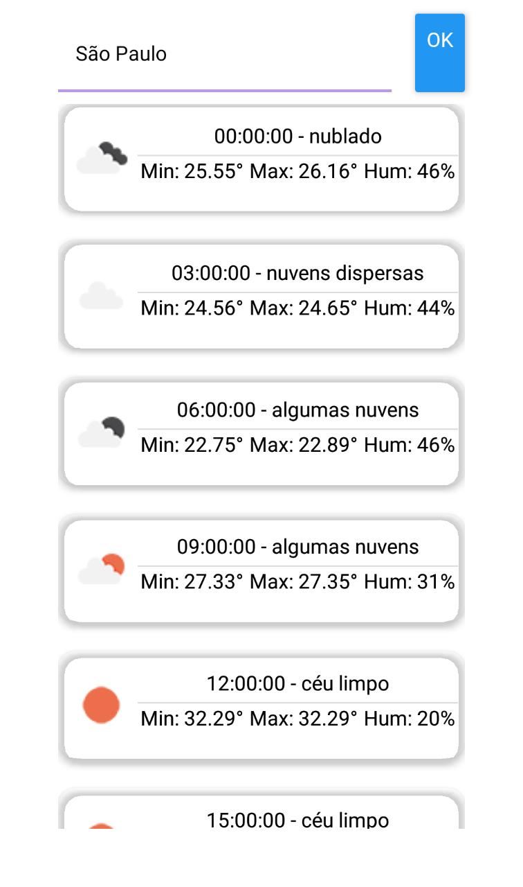
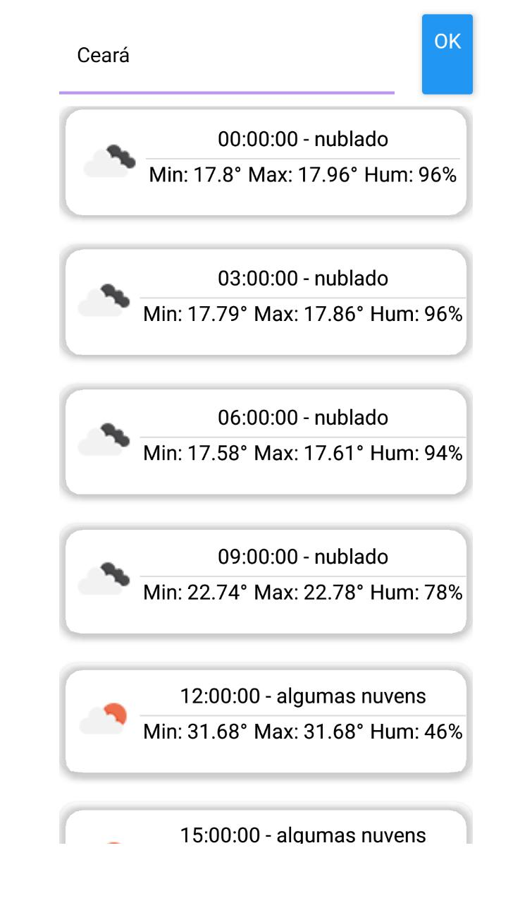

# Previsão do tempo

## ℹ️ Sobre
  Aplicativo multiplataforma de previssão do tempo, esse aplicativo tem como objetivo listar a previssão de um lugar que o usuário inseriu.

## 🚀 Tecnologias
  * [**React-Native**](https://reactnative.dev/) 
  * [**Expo**](https://expo.io/)
  * [**Api OpenWeather**](https://openweathermap.org/api): API para fazer a listagem da previsão do local. 

<b>Mobile</b>

  
  

